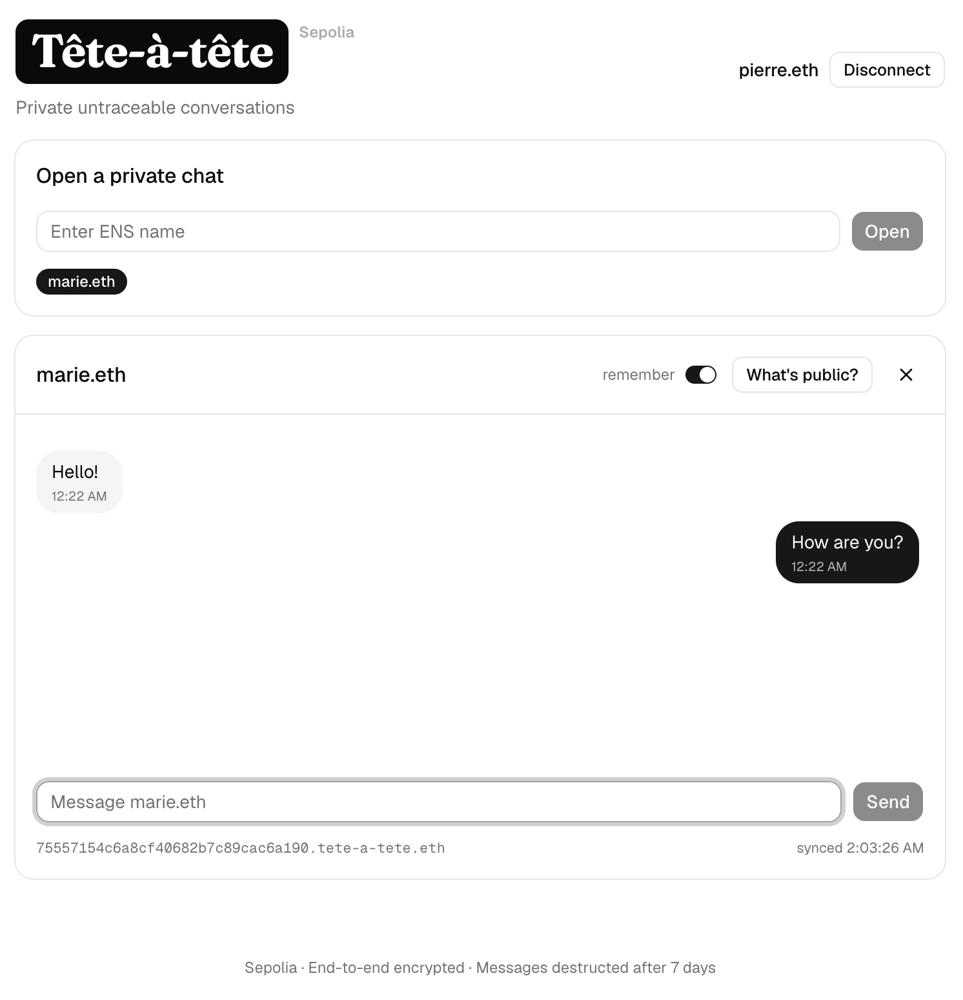

# Tête-à-tête

**Private pairwise channels resolved through ENS.**

Live: **https://tete-a-tete-eth.vercel.app** (Sepolia) · Resolver: [`0x56E996B6…`](https://sepolia.etherscan.io/address/0x56E996B6f96B79eF02Ac16afB92660293B52460A) · Parent: `tete-a-tete.eth`



ENS gives every identity a public place. Tête-à-tête gives every *pair* a private one. Two names each compute a shared secret subname under `tete-a-tete.eth` that nobody registers or announces, and use it as an encrypted, weekly-expiring mailbox — read through standard ENS resolution. The app remembers nothing but your key.

Runs on **Sepolia, on the ENSv2 beta deployment**: names are registered through [app.ens.dev](https://app.ens.dev), resolution goes through the ENSv2 Universal Resolver, and the parent name's resolver is set on the ENSv2 ETH registry.

## How it works

1. **Enable (one transaction).** The app generates a dedicated X25519 key `R` in the browser (non-extractable WebCrypto key, stored in IndexedDB) and publishes the public half as the `rdv-key` text record on your ENS name. Rotate every 30 days.
2. **Open a channel with `pierre.eth`.** The app reads Pierre's `rdv-key`, derives `s = ECDH(r_me, R_pierre)`, and from `s` derives this week's keys with HKDF: a **label**, an **encryption key** and a **write key** — one set per direction.
3. **The mailbox is an ENS name.** `<label>.tete-a-tete.eth` resolves through an ENSIP-10 wildcard resolver that uses EIP-3668 CCIP-Read (the ENSv2 Universal Resolver walks the registry tree, finds `tete-a-tete.eth`'s resolver and calls it for any subname). The gateway returns a fixed-size ciphertext as the `rdv` text record; the resolver's callback verifies the gateway's signature and expiry on-chain. Reads are plain `getEnsText()` calls.
4. **Writes** are POSTed to the gateway signed with the derived Ed25519 write key. The gateway binds the first writer key to the label and rejects anyone else. It never sees a wallet.
5. **Every week the label rotates**, and the gateway forgets each record 7 days after it was written. After that, nothing exists anywhere except local copies you chose to keep.

```
marie.eth ──rdv-key──► X25519 pub (on-chain, public)
pierre.eth ──rdv-key──► X25519 pub (on-chain, public)

s = ECDH(r_marie, R_pierre) = ECDH(r_pierre, R_marie)          never stored
HKDF(s, week, direction) → label · encKey · writeKey            dropped when the week leaves the read window

text(namehash("<label>.tete-a-tete.eth"), "rdv")
  → UniversalResolver → RendezvousResolver.resolve()  (ENSIP-10)
  → OffchainLookup → gateway GET                       (EIP-3668)
  → resolveWithProof(): signature + expiry check       (on-chain)
  → base64(nonce ‖ XChaCha20-Poly1305(pad16k(log)))    (only the pair can open it)
```

## Protected from whom

| Information | Hidden from | How |
|---|---|---|
| That Marie and Pierre talk | public, chain, gateway, `tete-a-tete.eth` owner | the label needs a private key to derive |
| Contents | everyone | AEAD under a weekly key, fixed 16 KiB padding |
| Who wrote | everyone | derived Ed25519 write key, no wallet involved |
| Week-to-week linkage | everyone | weekly labels, weekly keys, per-direction write keys |
| Contacts on this device | anyone with the browser | not stored by default ("remember" is opt-in, names only) |
| Past traffic after `R` leaks | attacker | bounded to the current 30-day rotation window |

## Gateway API

Any host can run one; the resolver lists the URL on-chain.

| Route | Purpose |
|---|---|
| `GET /api/ccip/{sender}/{data}` | EIP-3668 read. Returns `{ data: abi.encode(result, expires, sig) }` signed by `GATEWAY_SIGNER_KEY`. |
| `POST /api/write` | `{ node, blob, writer, ts, sig }`. Ed25519 check, writer binding, monotonic timestamp, exact size, 7-day TTL. |
| `GET /api/record/{node}` | What the gateway holds for a node — powers the "What's public?" panel. |
| `GET /api/gateway` | Signer address and URL template, for `setSigners` / `setUrls`. |

Verify the full path from a terminal: `pnpm --filter web tsx scripts/e2e-ens.mts` seals a record, writes it, and reads it back with `getEnsText()` through the Universal Resolver.

## Run locally

```bash
pnpm install && (cd packages/contracts && forge install)   # forge libs are not committed
cp apps/web/.env.example apps/web/.env.local     # fill NEXT_PUBLIC_RPC_URL, resolver address, Upstash, GATEWAY_SIGNER_KEY
pnpm test                                        # core + gateway unit tests
(cd packages/contracts && forge test)
pnpm dev                                         # http://localhost:3000 — UI and gateway
pnpm --filter web smoke                          # signed write + CCIP read against the running gateway
```

Without Upstash credentials the gateway keeps records in memory (dev only). Note that reads always go through the gateway URL stored on-chain (currently the live deployment), so a local gateway only serves reads after `setUrls()` points at it. Append `?now=2026-09-12T10:00:00Z` to the URL to shift the demo clock and watch the label rotate.

## Deploy

**Contracts (once).**

```bash
cd packages/contracts && cp .env.example .env    # SEPOLIA_RPC_URL, DEPLOYER_PRIVATE_KEY, GATEWAY_URL, GATEWAY_SIGNER
source .env && forge script script/Deploy.s.sol --rpc-url sepolia --broadcast --verify
```

Then point the parent at it on the ENSv2 ETH registry (the owner of `tete-a-tete.eth` signs; `anyId` is the labelhash):

```bash
cast send $ETH_REGISTRY 'setResolver(uint256,address)' $(cast keccak tete-a-tete) $RENDEZVOUS_RESOLVER --rpc-url $SEPOLIA_RPC_URL --private-key $OWNER_KEY
```

or open `/admin` in the app with the owner wallet. The live registry is discovered from the Universal Resolver (`findParentRegistry`). Addresses used for this deployment are in `packages/contracts/deployments/sepolia.json`. Change the gateway later with `setUrls()` / `setSigners()` — no redeploy.

**App + gateway.** One Next.js app with `output: "standalone"`; needs `GATEWAY_SIGNER_KEY`, `UPSTASH_REDIS_REST_URL`, `UPSTASH_REDIS_REST_TOKEN` and the `NEXT_PUBLIC_*` values. Works on a [Stasho](https://stasho.xyz) App VM (self-custodial, Aleph), on Vercel, or any Node host. After deploying, point the resolver at `https://<host>/api/ccip/{sender}/{data}` with `setUrls()`.
